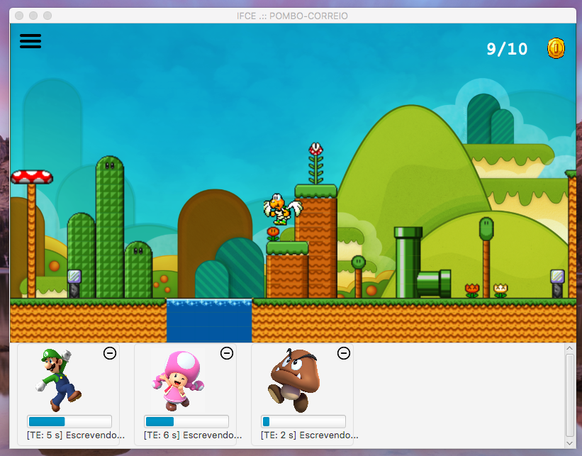

# PomboCorreio
Um trabalho da cadeira de Sistemas Operacionais aplicando conceitos de programação paralela.

## Diagrama de Classes
Aplicamos o design pattern MVP (Model-View-Presenter) para organização das classes da interface e lógica.

